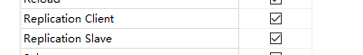

# 前言

本项目仅供学习参考，暂未进行真实生产环境测试，如导致任何问题，本人概不负责。

因为https://github.com/shyiko/mysql-binlog-connector-java已经不维护了，所以自己看mysql文档写一个，目前已经支持常用字段的解析。

使用过程中若遇到问题，欢迎提供issus

# 项目介绍

## 1、参考文献

- mysql源码 https://github.com/mysql/mysql-server/blob/8.0
- mysql8.0文档 https://dev.mysql.com/doc/dev/mysql-server/latest/
- binlog项目 https://github.com/shyiko/mysql-binlog-connector-java
- open-replicator
- mysql源码剖析–通信协议分析 https://blog.csdn.net/fs3296/article/details/117044104

## 2、目前有以下的mysql字段类型暂时不支持解析：

|      字段类型      | 支持解析 |                         其他说明                         |
| :----------------: | :------: | :------------------------------------------------------: |
|     multipoint     |    ✖     |                                                          |
|        Json        |    ✔     | 支持解析，目前仅返回原始byte数组，尚未解析承成jsonObject |
|     linestring     |    ✖     |                                                          |
|    multipolygon    |    ✖     |                                                          |
|       point        |    ✖     |                                                          |
|      polygon       |    ✖     |                                                          |
|      geometry      |    ✖     |                                                          |
| geometrycollection |    ✖     |                                                          |

## 3、安装方式

目前没有上传到maven中央仓库，请下载源码执行maven打包为jar，并在pom.xml引入

## 4、使用方式

**注意：若使用非root用户进行连接，请确保非root用户拥有slave监听的权限**



```java
    public static void main(String[] args) throws Exception {
        MysqlBinLogConnector connector = MysqlBinLogConnector.openConnect("127.0.0.1", 3306, "你的数据库用户名", "你的数据库密码", false, null);
        connector.sendComBingLogDump();
        connector.registerEventListener(new EventListener() {
            @Override
            public void listenAll(Event event) {
                //监听所有事件
            }

            @Override
            public void listenUpdateEvent(Event event) {
                //监听更新事件
            }

            @Override
            public void listenDeleteEvent(Event event) {
                //监听删除事件
            }

            @Override
            public void listenInsertEvent(Event event) {
                //监听新增事件
            }
        });
    }
```


